# 📊 OLAP Cube and Power BI Reporting 

For this, I use the data warehouse implemented and populated in Data-Warehouse-ETL-Project. It is designed in a Snowflake schema and implemented in Microsoft SQL Server. The data warehouse supports analytical reporting for hospital operations such as patient visits, department services, and financial metrics

### 🧾 Fact Table – `FactEncounters`
- **Keys**: EncounterID, PatientKey, DepartmentKey, HospitalKey, DateKeys
- **Measures**: TotalCharge, TotalPayment, TotalAdjustment, Duration, accm_txn times

### 📘 Dimension Tables
- `DimPatient` – SCD Type 2
- `DimDepartment` – Department metadata
- `DimHospital` – Hospital info
- `DimDate` – Calendar dimension (1990–2099)

---

## 🧮 OLAP Cube Implementation (SSAS)

### 🔧 Tools Used:
- SQL Server Analysis Services (SSAS)
- SQL Server Data Tools (SSDT) in Visual Studio

### 🛠️ Cube Implementation Steps:
1. **New SSAS Project** in Visual Studio
2. **Data Source**: Connected to SQL Server DW
3. **Data Source View (DSV)**: Included relevant fact/dimension tables

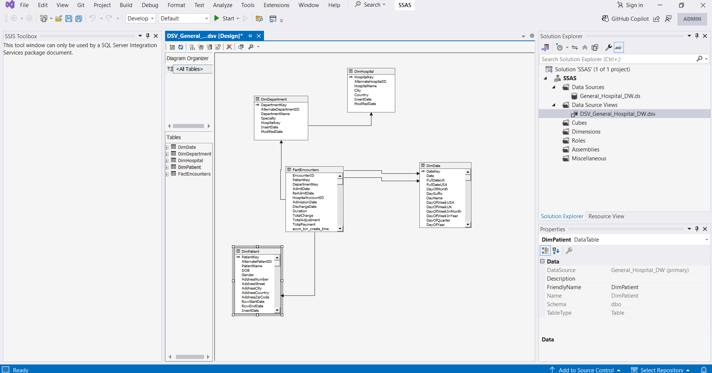
 
4. **Cube Wizard**:
   - Selected `FactPatientEncounter` as fact table
   - Defined measures (e.g., TotalCharge, Duration)
   - Added dimensions: `DimPatient`, `DimDate`, `DimDepartment`, `DimHospital`
5. **Deployment**: Cube deployed to local SSAS server

  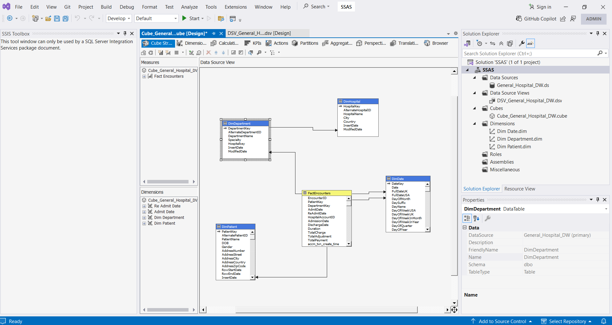

  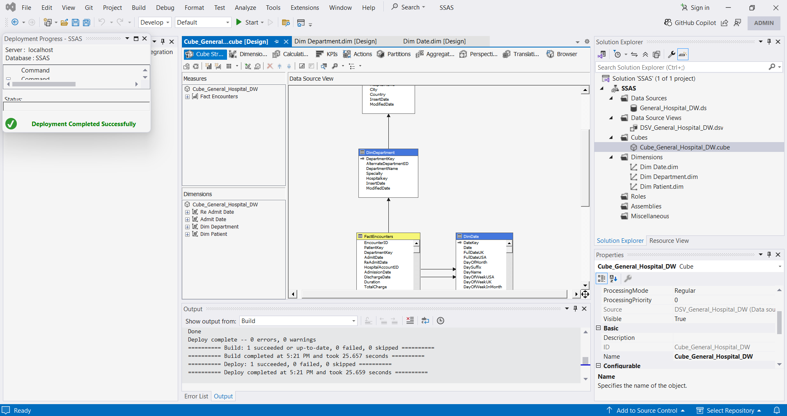

6. **Browsing & Querying**: Cube tested using Visual Studio browser and Excel

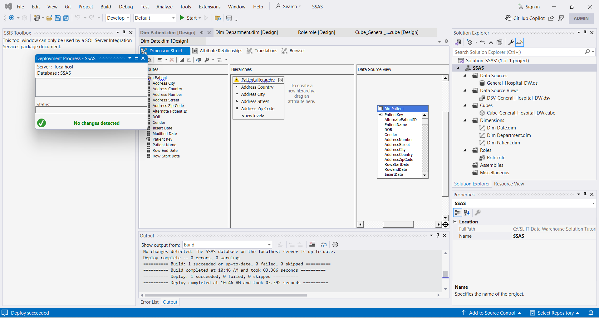

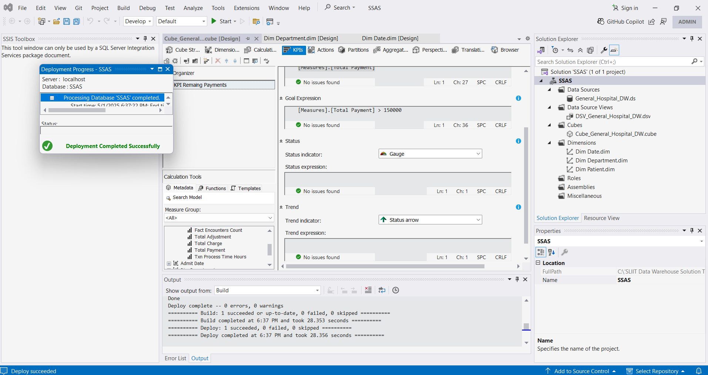

---

## 🧪 OLAP Operations Demonstrated

### 📈 1. PivotChart – Department Duration Analysis
Visualized % duration across departments.  

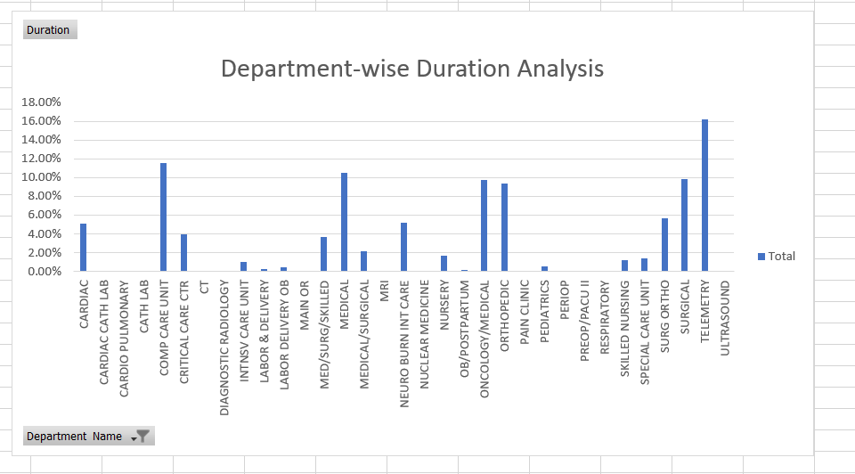

### 🧮 2. Roll-Up
Rolled up patient data hierarchy: **Street → City → Region** to view aggregated insights.

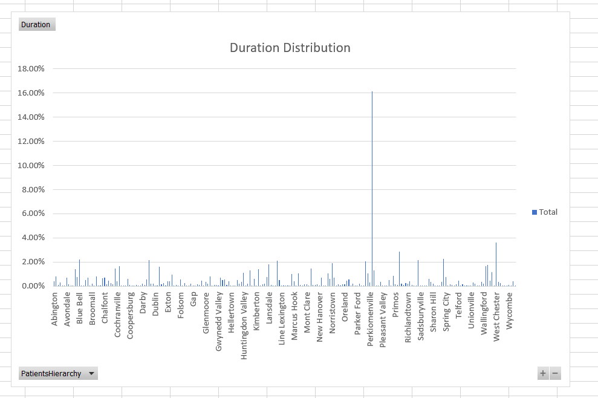

### 🔎 3. Drill Down
Explored metrics from City → Street → Individual Patient level for granular analysis.

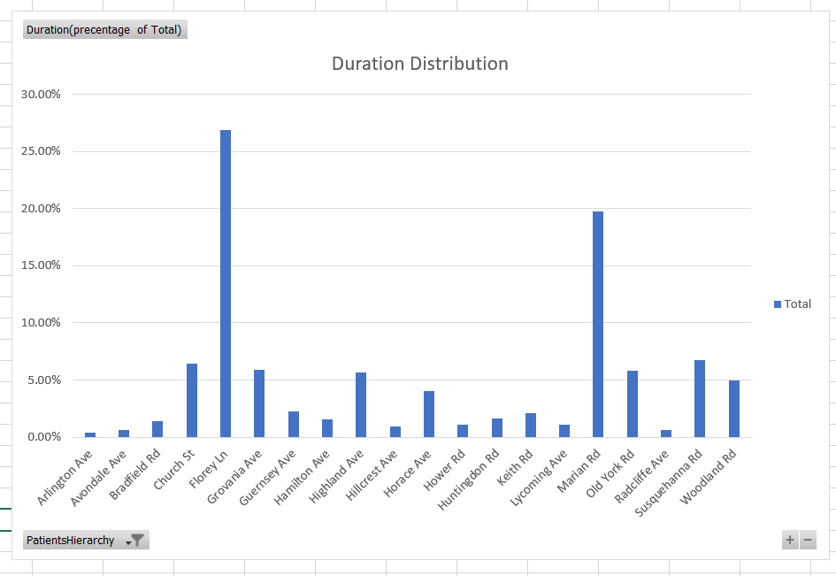

### 🪞 4. Slice
Sliced cube on dimension value (e.g., Department = "Cardiology") for targeted analytics.

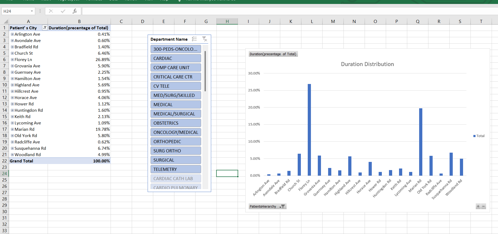

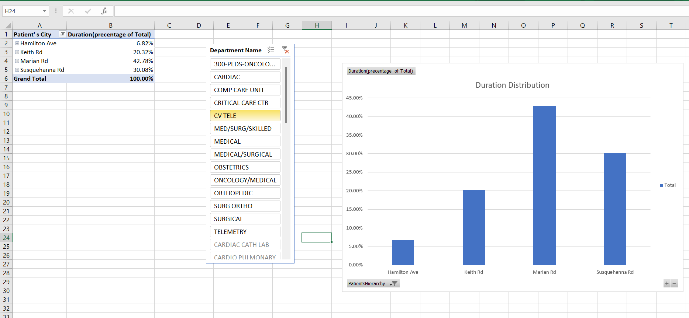

### 🎲 5. Dice
Filtered cube on multiple dimensions: departments, hospitals, patient location, and length of stay.

---

## 📊 Power BI Reports

### 📌 Report 1 – Matrix View
- Rows: Departments | Columns: Hospitals
- Measures: TotalCharges
- Interactive expansion/collapse supported

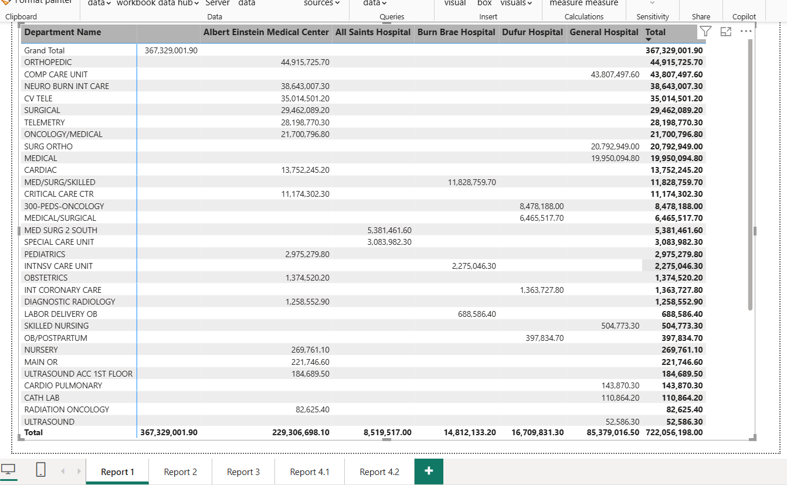

### 📌 Report 2 – Cascading Slicers
- Slicers: City → Street
- Responsive visuals (bar, pie charts) showing patient distribution and charges

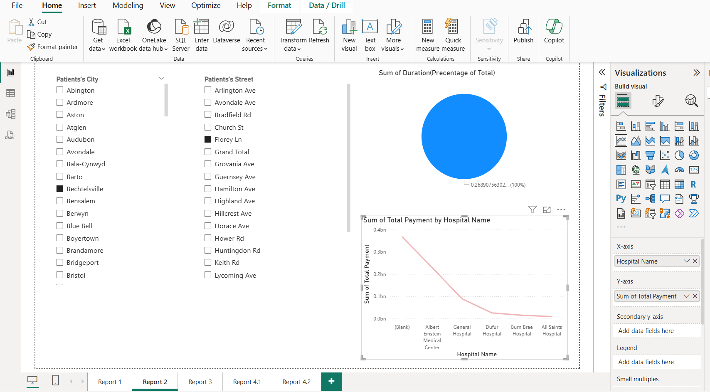

### 📌 Report 3 – Drill-Down Hierarchy
- Custom hierarchy: Hospital → Department
- Users can drill into detailed departmental metrics

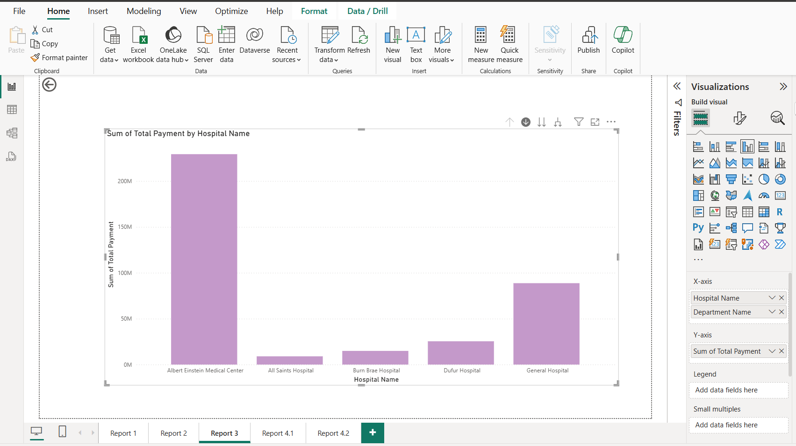

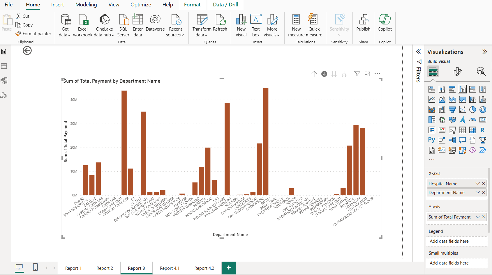

### 📌 Report 4 – Drill-Through Functionality
- Navigate from summary (e.g., by city) to detailed patient-level data
- Enhances root-cause exploration

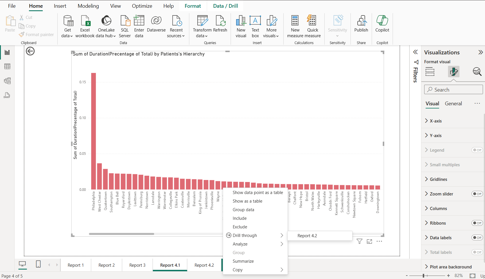

---

## 💡 Key Highlights

✅ OLAP cube modeling with SSAS  
✅ Cube browsing via Excel & Visual Studio  
✅ Hierarchies, KPIs, Measures  
✅ Full OLAP operation coverage: Slice, Dice, Roll-Up, Drill-Down  
✅ Dynamic Power BI reports with drill-through & slicers

---

## 📜 License

This project is created for academic and portfolio purposes. Reuse is permitted with proper credit.

